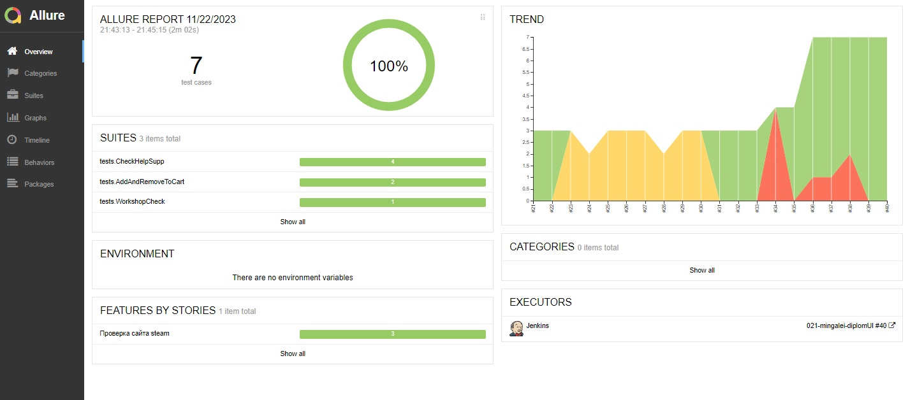

# Проект по автоматизации тестовых сценариев для сайта компании [Steam](https://store.steampowered.com)
<p align="center"><a href="https://store.steampowered.com/"></a></p>  

> Steam - олнлайн-сервис цифрового распространения компьютерных игр и программ, разработанный и поддерживаемый компанией Valve.  

## :notebook: Содержание:

- [Стек технологий](#computer-стек-технологий)  
- [Тестовые сценарии](#clipboard-тестовые-сценарии)
- [Сборка в Jenkins](#-сборка-в-jenkins)
- [Команды для запуска](#rocket-команды-для-запуска)
- [Allure отчет](#-allure-отчет)
- [Интеграция с Allure TestOps](#-интеграция-с-allure-testops)
- [Интеграция с Jira](#-интеграция-с-jira)
- [Уведомления в Telegram чат с ботом](#-уведомления-в-telegram-чат-с-ботом)
- [Видео запуска тестов в Selenoid](#-видео-запуска-тестов-в-selenoid)  

---

## :computer: Стек технологий
<p align="center">
<a href="https://www.java.com/"></a>
<a href="https://www.jetbrains.com/idea/"></a>
<a href="https://www.github.com/"></a>
<a href="https://www.gradle.org/"></a>
<a href="https://www.junit.org/junit5/"></a>
<a href="https://www.selenide.org/"></a>
<a href="https://www.aerokube.com/selenoid/"></a>
<a href="https://www.jenkins.io/"></a>
<a href="https://github.com/allure-framework/allure2"></a>
<a href="https://www.qameta.io/"></a>
<a href="https://www.atlassian.com/software/jira"></a>
<a href="https://www.telegram.org/"></a>
</p>

---

## :clipboard: Тестовые сценарии

### Автоматизированные проверки
- :white_check_mark: Корзина игр
    - :heavy_check_mark: Проверка добавления нужной игры в корзину
    - :heavy_check_mark: Проверка уделения добавленной игры из корзины
- :white_check_mark: Раздел "Поддержка"
    - :heavy_check_mark: Проверка подраздела 'Я не могу вспонить имя или пароль'
    - :heavy_check_mark: Проверка подраздела 'Мой аккаунт украли'
    - :heavy_check_mark: Проверка подраздела 'Письмо с кодом не пришло'
    - :heavy_check_mark: Проверка раздела 'Мобильный аутентификатор удалён или утерян'
- :white_check_mark: Раздел "Мастерская"
    - :heavy_check_mark: Проверка наличия нужного раздела и проверка по тексту

### Ручные проверки
- :white_check_mark: Проверка раздела предметы за очки
- :white_check_mark: Проверка Трансляции

---

##  Сборка в [Jenkins](https://jenkins.autotests.cloud/job/tinkoff_autotests_kpoludnitsyn_new/)

<p align="center">

</p>

### Параметры сборки проекта

| Параметр        | Назначение                               |
|-----------------|------------------------------------------|
| REMOTE_URL      | Удаленный сервер для запуска тестов      |
| BROWSER         | Браузер для запуска                      |
| BROWSER_VERSION | Версия браузера                          |
| BROWSER_SIZE    | Разрешение экрана                        |
| BASE_URL        | Адрес сайта                              |
| TASK            | Опция выбора запуска определённых тестов |

### Запуск тестов с параметрами в **Jenkins**

<p align="center">

</p>

---

## :rocket: Команды для запуска

### Локальный запуск

```bash
gradle clean test
```

### Удаленный запуск
```bash
clean
${TASK}
-Dbrowser=${BROWSER}
-DbrowserSize=${BROWSER_SIZE}
-DbrowserVersion=${BROWSER_VERSION}
-DbaseUrl=${BASE_URL}
-DremoteUrl=${REMOTE_URL}
```

##  [Allure](https://jenkins.autotests.cloud/job/021-mingalei-diplomUI/allure/) отчет

### Главная страница отчета

<p align="center">

</p>

### Тест-кейсы

<p align="center">

</p>

#### Содержание тест-кейсов

- :heavy_check_mark: Подробное описание шагов
- :heavy_check_mark: Тег
- :heavy_check_mark: Критичность теста
- :heavy_check_mark: Автор
- :heavy_check_mark: Последний скриншот для каждого теста 
- :heavy_check_mark: HTML разметка страницы
- :heavy_check_mark: Логи браузера
- :heavy_check_mark: Видео с прохождением теста

### Графики

<p align="center">

</p>

---

##  Интеграция с [Allure TestOps](https://allure.autotests.cloud/project/3829/dashboards)

### Dashboard

<p align="center">

</p>

### Ручные и автоматизированные тест-кейсы

<p align="center">

</p>

---

##  Интеграция с [Jira](https://jira.autotests.cloud/browse/HOMEWORK-973)

### Задача в Jira

<p align="center">

</p>

#### Содержание задачи

- :heavy_check_mark: Цель
- :heavy_check_mark: Задачи для выполнения
- :heavy_check_mark: Тест-кейсы из Allure TestOps
- :heavy_check_mark: Результат прогона тестов в Allure TestOps

---

##  Уведомления в Telegram чат с ботом

### Уведомление через чат бот

<p align="center">

</p>


#### Содержание уведомления в Telegram

- :heavy_check_mark: Окружение
- :heavy_check_mark: Комментарий
- :heavy_check_mark: Длительность прохождения тестов
- :heavy_check_mark: Общее количество сценариев
- :heavy_check_mark: Процент прохождения тестов
- :heavy_check_mark: Ссылка на Allure отчет

---

##  Видео запуска тестов в Selenoid

<p align="center">

</p>
